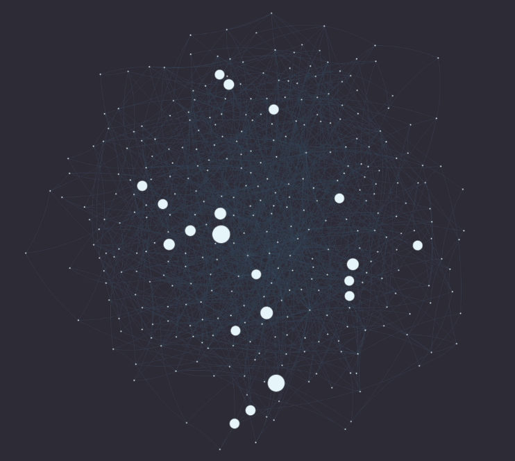
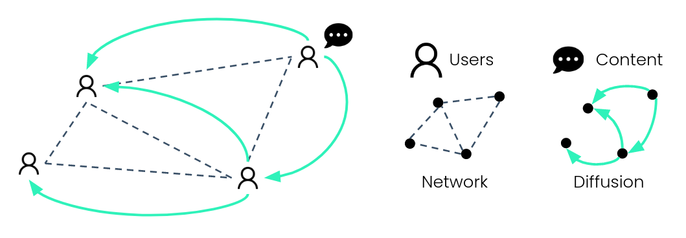

# Influence Maximization and Fairness in Social Networks at Scale

[Project Overview](#project-overview)  •  [Repository](#repository)  •  [Contact Us](#contact-us)  •  [Who We Are](#who-we-are)

This README provides an overview of a project completed as part of UC Berkeley's Masters of Information and Data Science program (see "Who We Are" section below). You can find a more visual representation of our project on our Github Page: https://autumninthecloud.github.io/IM_w_fairness/ 

Continue reading below to understand the project itself, what our repo contains (and learn about how to use the code), ethical considerations, and how to contact us. Click the "details" buttons to show the text in each section below.

## Project Overview

 
Click to expand details!

In 2009, Sina Weibo – a Twitter-like platform in China – had over a million users who retweeted over 20 million messages. Most of these originated with a few “influential” users, whose original messages were retweeted many times. In the Sina Weibo network, each **node** represents a user and each **edge** represents a retweet. 

Some influencers start huge chains of retweeting, where their message is retweeted over an over. This is called a **cascade**. The largest cascade in this Sina Weibo network is over 50,000 retweets long. 
 

What if we have a message we want to share widely on Sina Weibo? How might we find the right influencers, who will be able to start these large cascades and share that message with the most people? This problem could apply to any kind of message, like an ad about a product we want to sell, a call for donations for a cause, or important information many people should know, like information about the COVID-19 vaccine.

**Influence maximization** algorithms solve this problem. More formally, an IM algorithm finds the set of *k* influencers that maximize information spread in the network. 

Some influencers share information with many different people, who might represent a diversity of genders, classes, races, ethnicities, et cetera. Others might share information just as widely, but only with a certain group. 

If the *cascade distribution* for a given attribute looks similar to that of the *broader network*, we might think of this as **"fair"** information spread. This concept of fairness is similar to what some might recognize as **"demographic parity"**.

**Our project updates influence maximization to find the most fair and impactful influencers.**

### Influence Maximization

[INSERT MORE IN-DEPTH EXPLANATION OF IM]

### Fairness 

[INSERT MORE IN-DEPTH EXPLANATION OF FAIRNESS]

### Solutions 

[INSERT EXPLANATION OF FPS/FAC]

### Experiments

We divided our replication efforts into three phases: 

1. Initial replication
2. Code refactoring and data pipeline implementation
3. Repeat replication and results validation

In the first phase, we tried to run the process end-to-end while changing the code as minimally as possible. We downloaded the original dataset from Baidu and ran the entire process with the dataset. In certain instances, we needed to make edits to address bugs that we faced. In our second phase, we began to refactor and document the code to improve efficiency and readability where possible. We also implemented a data pipeline where we hosted the input data on Google Drive and then created scripts to ingest the data, uncompress the files, and run the process end-to-end. 

We hope that the creation of this pipeline will make it easier for others to experiment with this project. In the final phase, we repeated the replication process by running all of the Python scripts and then validated the results.

### Evaluation

The original research evaluated the performance of the FPS and FAC models by comparing it with two other algorithms in terms of their objective function scores, the number of influenced nodes, and execution time. 

Due to time constraints, we were unable to connect our results with the research team’s stated results. However, we can share the original aims of the research and report how well our data trends with their assumptions.

#### Influence Maximization with Fairness 🟡

To rank how well the algorithms scored in comparison with other methods, the researchers used an objective function to measure the tradeoffs between maximizing influence and fairness guarantees in the resulting population from their set of selected influencers. This equation takes the influence and fairness scores and normalizes them by their upper bounds, leading to an objective value between 0 and 1.

To utilize this in real world applications, a policy maker could select an importance factor between 0 (fairness) and 1 (influence) to rate influence or fairness more highly in evaluating the algorithm. The researchers used a value of 0.8 to reflect the priority of influence over fairness in most real world scenarios. 

In their work, they found that FPS resulted in higher scores for both the number of influenced users and in the overall objective function than FAC, and our data indicated the reverse relation when plotted across the same sets of users. Also of note, for each set of influences, our proportion of users influenced was at least 30% lower than what was given in the research results. 

Additionally, our data showed that FAC had lower fairness scores on average when compared to FPS, but when combined into their objective function, FAC still outperforms FPS due to the fact that they set the objective function to weight influence more heavily than fairness. 

Given that the initial aim of this research was to conduct comparative analysis with other algorithms, our results have limited application beyond the specific models, but it is our hope that our conclusions can benefit the researchers in making improvements in their future work.

#### At Scale 🟢

There are scalability gains in this deep learning approach over previous work in the influence maximization literature. They back this up with execution time plots between the FPS, FAC and the two other algorithms.

Because we were unable to gain access to the complete set of research code during the course of our project, we can only speak at the theoretical level about how these approaches make improvements, and we can also verify that our team successfully ran both models locally.

There are also gains in how the training data is constructed versus previous IM models. Rather than building the propagation network to model influence graphically (searching for nodes that are connected in a cascade via a directed edge), the research team modeled influence as the ability for an influencer to exert influence over other target users, which results in a reduction in time complexity in building the data. Creating the influencer target user pairs has a complexity of O(cn), where c is the number of cascades and n is the cascade size, and it is linear with the size of each cascade. This is an improvement over the aforementioned propagation network models that have a complexity of O(cn(n-1)/2).

Overall, we agree with the initial assumptions that a deep learning based approach for modeling influence is more scalable than previous efforts.

### Conclusion 

Targeting key influential people to spread information efficiently to a broader audience is a growing need for marketers advertising products or services as well as for policymakers looking to inform or educate the public. Machine learning techniques like Influence Maximization (IM) are a viable solution to these needs. Sensitive attributes like race or gender of users within a network are key variables to include when training machine learning models to reduce bias and unfair information spread. Our research used existing IM algorithms on a social network dataset from Sina Weibo, a social network in China, that was composed of tweets and retweets to study fair information spread. Profile information of users was utilized to classify users within one of two gender groups: male and female. From these aggregations, we trained and tested two IM models to study how information was spread and if fairness could be maintained.

From our research we have concluded that fairness can be introduced into influence maximization algorithms successfully. The two models studied in our research perform well compared to current cutting-edge IM models. We also incorporated ethical frameworks with our research in line with best practice to maintain privacy and fair use of user data. Future areas of work should focus on alternative definitions of fairness as well as continuing research of the ethical implications of utilizing user data for testing to protect privacy and minimize harm. We plan to incorporate additional sensitive attributes of user profiles such as location or topics of retweets to understand how the fair spread of information in social networks can be impacted.

## Repository 

This repository contains information and resources about this project (within the README and folders in the repo). We plan to share the code once the original paper has been published.

## Contact Us

If you have any input on the content of this repo, please submit a pull request. 

For anything else, please send us an email at team-influencers@googlegroups.com! We are happy to communicate about anything about this project, including:

* Any questions about how we worked together, our code, the dataset, etc.
* Ethical considerations (also see our ethics checklist directly [here](https://github.com/autumninthecloud/IM_w_fairness/blob/main/Ethics/ETHICS.md) or in our Ethics folder in the repo). For example...
  * If you find your data in our dataset, and would like us to delete it
  * If you think we should delete the data we have posted publicly 

## Who we are

We are Team Influencers, a group of students in the University of California, Berkeley's Masters of Information and Data Science program. We completed this project for our program capstone during the 2022 summer semester. You can find our project on the Berkeley website **HERE (need to add later)**. Other capstone projects are listed on this page: https://www.ischool.berkeley.edu/programs/mids/capstone. 

**Team Members (in alphabetical order)** 

[David Peletz](https://www.linkedin.com/in/david-peletz/)

[Autumn Rains](https://www.linkedin.com/in/autumninthecloud/)

[Sophia Skowronski](https://www.linkedin.com/in/sophiaskowronski/)

[Alissa Stover](https://www.linkedin.com/in/alissa-stover/)

**Advisors (in alphabetical order)**

[Prof. Alberto Todeschini](https://www.ischool.berkeley.edu/people/alberto-todeschini)

[Prof. Puya Vahabi](https://www.ischool.berkeley.edu/people/puya-h-vahabi)

**Additional thanks to everyone who gave us feedback along the way (in alphabetical order)**

Usability study participants

[Prof. Morgan Ames](https://www.ischool.berkeley.edu/about/profiles/morgan-ames)

Ankitkumar Patel
